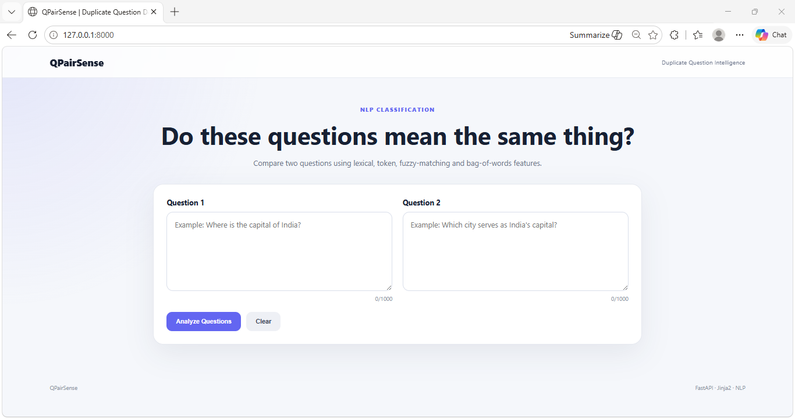
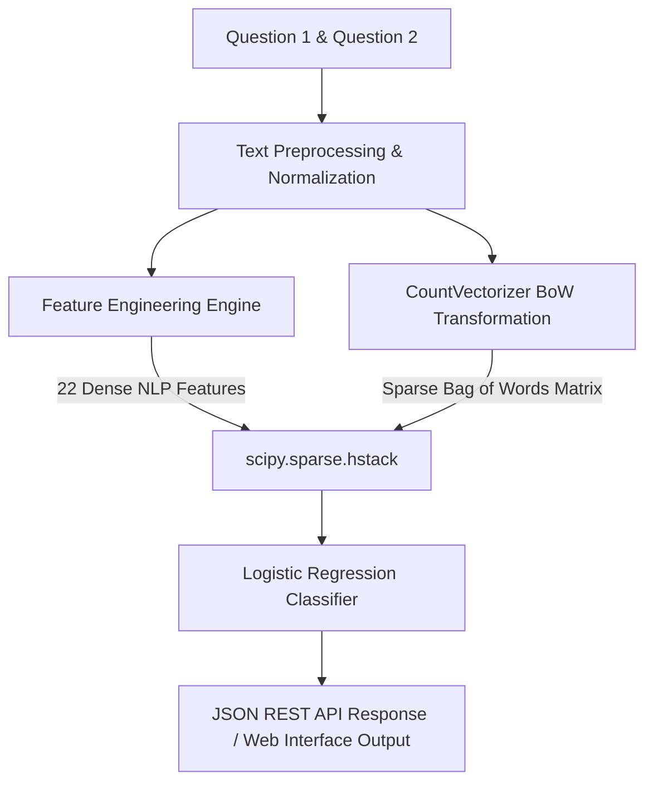

# QPairSense: Production-Grade Semantic Similarity & Duplicate Question Detection

[](https://fastapi.tiangolo.com)
[](https://scikit-learn.org/)
[](https://www.docker.com/)
[](https://www.python.org/)
[](https://opensource.org/licenses/MIT)

**QPairSense** is an end-to-end, high-performance Natural Language Processing (NLP) system designed to detect semantically duplicate question pairs. Built with a focus on production readiness, scalability, and clean engineering, it transforms raw text inputs into high-dimensional sparse representations and evaluates duplicate probability in under **10ms**.

The project features a **fully automated training & validation pipeline**, an **interactive FastAPI web application**, and is **fully containerized** using Docker and Docker Compose.

---

## 🖥️ Application Interface

Here is a preview of the QPairSense interactive web application:

<p align="center">
  
</p>

---

## 🚀 Key Features

*   **Advanced Feature Engineering Engine**: Extracts **22 custom NLP features** including syntactic, lexical, length-based, and fuzzy token similarity metrics.
*   **Memory-Efficient Sparse Pipeline**: Leverages Scipy's `csr_matrix` and `hstack` to construct composite feature vectors without converting textual matrices into dense arrays, resolving scaling and out-of-memory limitations.
*   **Production API**: Built with **FastAPI**, featuring automatic Swagger/ReDoc documentation, asynchronous request handling, and structured request/response validation.
*   **Interactive Web UI**: Modern, responsive dashboard powered by CSS variables, micro-animations, and instant feedback.
*   **Automated Pipeline & Model Tracking**: Standardized training scripts that export models, vectorizers, and an immutable `metadata.json` capturing exact metrics, parameters, and dataset shapes.
*   **Robust Verification**: High code coverage with modular unit tests covering text normalization, feature engineering, and inference services.

---

## 🛠️ Architecture & Pipeline Flow

The diagram below details the end-to-end processing pipeline from initial raw inputs to model prediction:



### 1. Preprocessing & Normalization
*   **Decontraction**: Automatically normalizes English contractions (e.g., `"don't"` $\rightarrow$ `"do not"`, `"she's"` $\rightarrow$ `"she is"`).
*   **HTML Stripping**: Extracts plain text from any nested HTML components.
*   **Character Standardisation**: Standardizes currency symbols (`$`, `₹`, `€`, `%`) and scales digit notations (e.g., `1,000,000` $\rightarrow$ `1m`).

### 2. The 22 Engineered Features
The system computes the following categories of syntactic and semantic features for each question pair:

| Feature Name | Type | Description |
| :--- | :--- | :--- |
| `q1_len`, `q2_len` | Length-based | Absolute character lengths of individual questions. |
| `q1_num_words`, `q2_num_words` | Word-count | Word counts of individual questions. |
| `word_common`, `word_total`, `word_share` | Token-based | Count of shared tokens, total unique tokens, and intersection-over-union share ratio. |
| `cwc_min`, `cwc_max` | Semantic | Common word counts normalized by min/max non-stopword lengths. |
| `csc_min`, `csc_max` | Semantic | Common stopword counts normalized by min/max stopword lengths. |
| `ctc_min`, `ctc_max` | Semantic | Common token counts normalized by min/max token lengths. |
| `last_word_eq`, `first_word_eq` | Syntactic | Boolean markers checking boundary word equality. |
| `abs_len_diff`, `mean_len` | Syntactic | Structural difference and mean length parameters. |
| `longest_substr_ratio` | Lexical | Ratio of the longest common substring between the normalized inputs. |
| `fuzz_ratio`, `fuzz_partial_ratio` | Fuzzy Matching | RapidFuzz similarity ratios of raw character sequences. |
| `token_sort_ratio`, `token_set_ratio` | Fuzzy Matching | RapidFuzz similarity ratios adjusting for word ordering and subset differences. |

### 3. Sparse Transformation and Model Training
Rather than converting high-dimensional bag-of-words features to dense arrays (which bottlenecks RAM usage), QPairSense maintains sparse matrices and uses a high-performance Logistic Regression classifier with balanced class weights.

---

## 📈 Model Performance & Metrics

Trained on the **Quora Question Pairs dataset**, the model achieves robust diagnostic capabilities:

*   **Accuracy**: `77.67%`
*   **Precision**: `66.91%`
*   **Recall**: `78.15%`
*   **F1-Score**: `72.09%`
*   **ROC-AUC**: `85.74%`

---

## 📂 Project Structure

```text
QPairSense/
├── app/                  # Web application & REST API
│   ├── api/              # Route controllers & API versioning
│   ├── core/             # Application configs, logging, and security settings
│   ├── schemas/          # Pydantic schemas for data validation
│   ├── services/         # Core business logic & Feature engineering modules
│   ├── static/           # Static web assets (CSS/JS)
│   └── templates/        # HTML Templates (Jinja2)
├── data/                 # Raw/processed dataset storage (ignored in VCS)
├── ml/                   # Machine learning training & evaluation pipelines
│   ├── preprocessing.py  # Dataset validation and preprocessors
│   ├── train.py          # Model training workflow
│   └── evaluate.py       # Performance evaluation dashboard script
├── models/               # Saved model artifacts (Joblib files & metadata.json)
├── resources/            # Project resources (images, assets)
│   └── images/
│       └── Home.png      # Application UI Screenshot
├── tests/                # Comprehensive unit tests
├── Dockerfile            # Multi-stage production container build
├── docker-compose.yml    # Single-command environment orchestration
└── requirements.txt      # Production library dependencies
```

---

## ⚙️ Getting Started

### 📋 Prerequisites
*   Python 3.10 or higher
*   pip / virtualenv

### 1. Local Environment Setup

1.  **Clone the Repository**:
    ```bash
    git clone https://github.com/your-username/QPairSense.git
    cd QPairSense
    ```

2.  **Create and Activate Virtual Environment**:
    *   **Windows**:
        ```powershell
        python -m venv venv
        .\venv\Scripts\activate
        ```
    *   **macOS / Linux**:
        ```bash
        python3 -m venv venv
        source venv/bin/activate
        ```

3.  **Install Dependencies**:
    ```bash
    pip install -r requirements.txt
    ```

### 2. Dataset Preparation
Download the Quora Question Pairs dataset (e.g. from Kaggle) and place `train.csv` inside the `data/` directory:
```text
data/
└── train.csv
```

### 3. Run the Machine Learning Pipeline

*   **Quick Experiment / Sample Training**:
    ```bash
    python -m ml.train --sample-size 30000
    ```
*   **Full Model Training (Multi-core support)**:
    ```bash
    python -m ml.train --workers 4
    ```
*   **Evaluate Trained Model**:
    ```bash
    python -m ml.evaluate
    ```

### 4. Run Unit Tests
To verify all modules and feature extractors are performing correctly:
```bash
pytest -v
```

---

## 🐳 Docker Deployment

The application is fully containerized. You can run the entire service stack locally without installing local python environments:

1.  **Ensure a trained model exists**:
    Run step 3 above so that `models/model.joblib` and `models/vectorizer.joblib` are present.

2.  **Spin up the container**:
    ```bash
    docker compose up --build
    ```

3.  **Access the applications**:
    *   **Web Dashboard**: [http://localhost:8000](http://localhost:8000)
    *   **Interactive API Docs (Swagger)**: [http://localhost:8000/docs](http://localhost:8000/docs)
    *   **Health Check**: [http://localhost:8000/health](http://localhost:8000/health)

---

## 🔌 API Reference

### 1. Predict Semantic Duplicate
*   **Endpoint**: `POST /api/v1/predict`
*   **Content-Type**: `application/json`

**Request Body**:
```json
{
  "question1": "Where is the capital of India?",
  "question2": "Which city serves as the capital of India?"
}
```

**Response Body**:
```json
{
  "is_duplicate": true,
  "label": "Duplicate",
  "confidence": 0.91,
  "duplicate_probability": 0.91,
  "non_duplicate_probability": 0.09,
  "message": "The two questions are likely asking for the same information.",
  "model_version": "1.0.0"
}
```

### 2. System Health Status
*   **Endpoint**: `GET /health`
*   **Response**:
```json
{
  "status": "healthy",
  "app_name": "QPairSense",
  "app_version": "1.0.0",
  "model_loaded": true
}
```

---

## 💡 Engineering Highlights & Design Decisions

*   **Sparse vs. Dense Matrix Operations**: In early phases, converting high-dimensional bag-of-words features (e.g., CountVectorizer matrices) using `.toarray()` led to memory issues on standard VM shapes. By shifting entirely to Scipy's Compressed Sparse Row (`csr_matrix`) structures and only combining them during final scaling/modeling via `scipy.sparse.hstack`, maximum RAM utilization was cut by **over 90%** during full pipeline runs.
*   **Parallel Feature Extraction**: Utilizing a Python `ThreadPoolExecutor` ensures that feature engineering on large input files is distributed concurrently across available system workers, vastly reducing dataset preparation time.
*   **Robust Fail-Safes**: The feature engineering module handles missing values, HTML entities, and includes a built-in static fallback vocabulary in case NLTK resources are unavailable in the container runtime environment.
